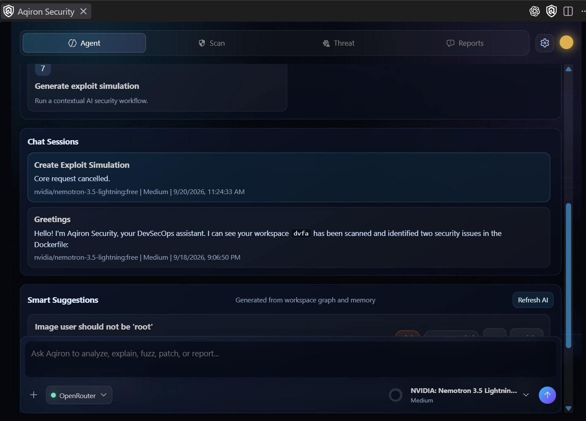
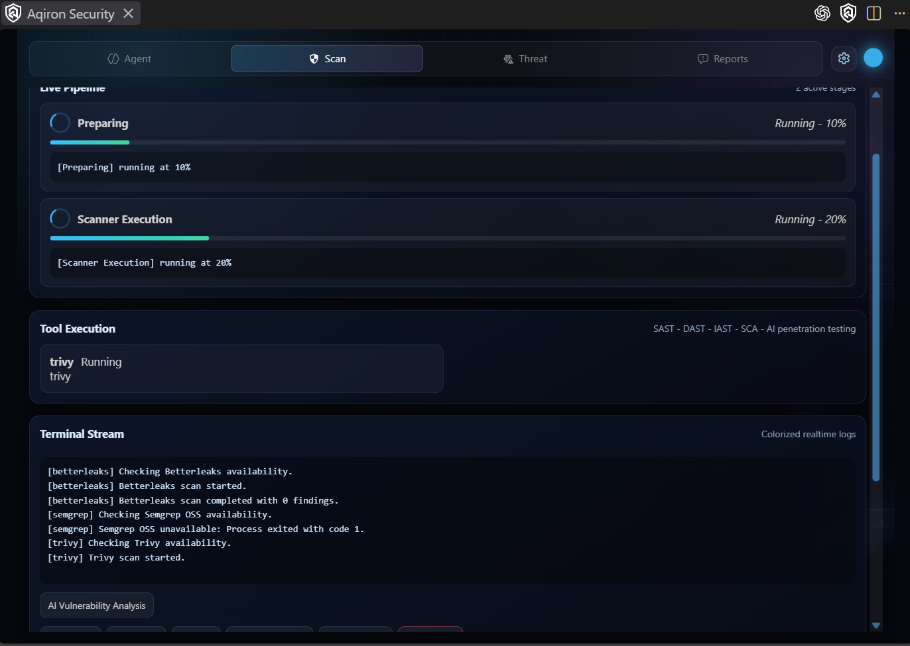
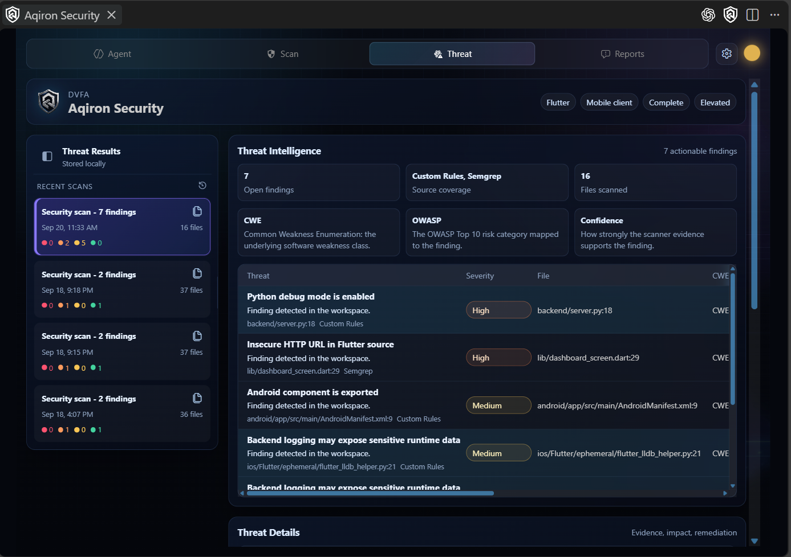
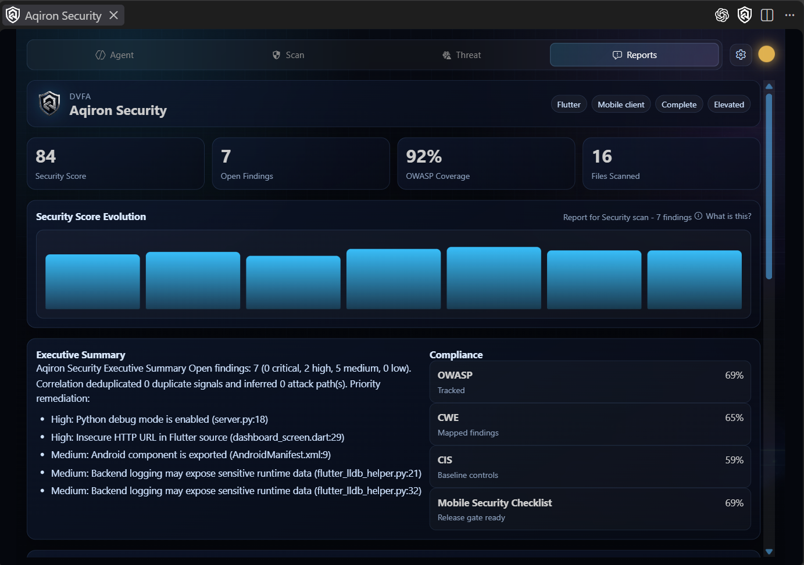

# Aqiron Security

Aqiron Security is a VS Code extension for local security scanning and security-focused workspace analysis. The repository contains the extension host, its webview, and a private TypeScript core runtime that the extension starts as a separate Node.js process.


## Current status

This repository is version `0.0.1` and is under active development. Workspace operations currently require a Flutter workspace. The implementation is local-first; visible UI or command paths should not be interpreted as evidence of a hosted Aqiron service, Jira integration, dynamic analysis, public report sharing, or automatic workspace-wide remediation.

## What Aqiron currently does

- Scans a supported current file or Flutter workspace.
- Publishes findings as VS Code diagnostics and in the Aqiron sidebar.
- Runs native pattern-based rules for selected Dart, Python, Android XML, and Dockerfile patterns.
- Integrates optional Betterleaks, MobSF, OSV-Scanner, Semgrep OSS, and Trivy scanners when their required tools or services are available.
- Normalizes and correlates findings, builds a relationship graph, and generates JSON, SARIF, and PDF report artifacts under `.aqiron-security/reports/`.
- Provides optional Ollama or OpenRouter AI operations and a workspace RAG index.
- Applies the currently implemented file-level quick fixes for a small set of deterministic findings.

External scanners and AI providers are optional. Missing scanners report an unavailable status instead of being treated as successful scans. Review AI output before using it for security decisions.

## Screenshots

### Agent



### Scan



### Threats



### Reports



## Requirements

- VS Code `^1.118.0`.
- Node.js and npm compatible with `package.json` and `package-lock.json`.
- A trusted Flutter workspace for workspace scans and RAG operations.
- Optional scanner executables or services: Betterleaks, OSV-Scanner, Semgrep, Trivy, and MobSF.
- Optional Ollama or OpenRouter configuration for AI operations.

## Development quickstart

Run these commands from the repository root:

```powershell
npm ci
npm run compile
npm test
npm run package
```

For interactive extension development, open the repository in VS Code, press `F5`, and use the `Run Extension` configuration to launch an Extension Development Host. `npm run watch` starts the TypeScript and esbuild watchers in parallel.

The main validation commands are also available independently:

```powershell
npm run check-types
npm run lint
```

`npm test` compiles test output, builds the extension, runs linting, and launches the VS Code test CLI. Tests are under `src/test/`.

## Commands and settings

The extension contributes commands for opening the sidebar, scanning a workspace or current file, refreshing scans, explaining issues, opening the security agent, analyzing a workspace, and managing the RAG index. The exact command IDs and settings are authoritative in [`package.json`](package.json).

Important settings include `aqiron-security.enableQuickFixes`, `excludeFolders`, `enableRealtimeScan`, `scanGeneratedFiles`, `maxFileSizeKB`, `mobsfBaseUrl`, `mobsfApiKey`, and `customRules`.

## Architecture

```text
VS Code extension host (`src/`)
  ├─ commands, diagnostics, sidebar/webview, settings, AI/RAG services
  ├─ current-file scanning and VS Code integration
  └─ CoreClient ── newline-delimited JSON over stdin/stdout ──┐
                                                              │
private core runtime (`packages/core/`)                      │
  ├─ native rules and optional scanner adapters                │
  ├─ finding normalization, correlation, graph, and reports    │
  ├─ AI and RAG services                                       │
  └─ filesystem, process, network, and credential adapters    │
                                                              └─ `dist/core-runtime.js`
```

`src/` is the VS Code host and user interface. `packages/core/` is marked private and is bundled into `dist/core-runtime.js`; it is not currently published as a standalone npm package. `src/core/CoreClient` starts the runtime, performs the protocol handshake, forwards events, and exposes runtime operations to the extension.

For the detailed implementation view, see [`ARCHITECTURE_DIAGRAMS.md`](ARCHITECTURE_DIAGRAMS.md), [`TECHNICAL_REVERSE_ENGINEERING.md`](TECHNICAL_REVERSE_ENGINEERING.md), and [`AQIRON_SECURITY_RAG.md`](AQIRON_SECURITY_RAG.md).

## Repository tour

| Path | Purpose |
| --- | --- |
| `src/` | VS Code extension host, commands, diagnostics, webview, AI, RAG, scanners, and tests. |
| `packages/core/` | Private core runtime and shared security services. |
| `assets/` | UI images, icons, logos, backgrounds, and generated visual assets. |
| `resources/` | Extension branding assets referenced by `package.json`. |
| `.github/` | Issue templates and the pull-request template. |
| `.vscode/` | Shared launch, task, extension recommendation, and workspace settings. |
| `scripts/` | Repository helper scripts. |
| `.aqiron-security/` | Generated workspace reports, RAG data, and threat history; keep local. |
| `package.json` | Extension manifest, commands, settings, dependencies, and scripts. |
| `packages/core/package.json` | Private core package metadata. |
| `esbuild.js` | Extension, core-runtime, and webview bundling. |
| `tsconfig.json` | TypeScript configuration. |
| `.gitignore` | Ignored local and generated content. |
| `.vscodeignore` | Files excluded from the packaged VS Code extension. |
| `LICENSE` | Mozilla Public License 2.0 text. |
| `CHANGELOG.md`, `ROADMAP.md`, `CONTRIBUTING.md`, `SECURITY.md`, `CODE_OF_CONDUCT.md` | Project history, roadmap, contribution, security, and community documentation. |

### Core package tour

```text
packages/core/
├─ package.json                         Private package metadata and internal exports
├─ tsconfig.json                        Core TypeScript project configuration
└─ src/
   ├─ index.ts                          Internal export barrel for core capabilities
   ├─ ai/
   │  ├─ analysis/                      AI vulnerability analysis and review
   │  ├─ providers/                     Ollama and OpenRouter provider adapters
   │  ├─ services/                      Provider, model, credential, and streaming services
   │  ├─ types/                         AI-specific types
   │  └─ utils/                         Request, retry, and timeout helpers
   ├─ analysis/                         Analysis types and RAG retrieval services
   ├─ context/                          Security context construction and prioritization
   ├─ correlation/                      Finding correlation and relationship graphs
   ├─ findings/                         Finding models and normalization helpers
   ├─ orchestration/                    Core scan service and orchestration types
   ├─ parsers/                          External scanner output parsers and schemas
   ├─ pipeline/                         Scan events, state, aggregation, and worker queue
   ├─ project/                          Project detection, profiles, and workspace models
   ├─ rag/                              RAG indexing, retrieval, signals, and regex loading
   ├─ reports/                          Report generation, models, exporters, and summaries
   ├─ runtime/
   │  ├─ main.ts                        stdin/stdout runtime process entry point
   │  ├─ coreRuntime.ts                 Runtime request handling and service coordination
   │  ├─ protocol.ts                    Runtime request, response, and event protocol
   │  ├─ nodeAdapters.ts                Node filesystem, process, network, and credential adapters
   │  └─ index.ts                        Runtime exports
   ├─ scanners/
   │  ├─ betterleaks/                   Betterleaks scanner adapter
   │  ├─ mobsf/                         MobSF scanner adapter
   │  ├─ native/                        Built-in workspace scanner
   │  ├─ osv/                           OSV scanner adapter
   │  ├─ semgrep/                       Semgrep scanner and rule manager
   │  ├─ trivy/                         Trivy scanner adapter
   │  ├─ scannerManager.ts              Scanner registration and selection
   │  ├─ scope.ts                        Scan scope definitions
   │  └─ types.ts                        Scanner interfaces and shared types
   ├─ shared/                           Cross-cutting AI, finding, pipeline, report, and platform types
   └─ telemetry/                        Core telemetry interfaces and implementation
```

| Path | Purpose |
| --- | --- |
| `packages/core/src/ai/` | Provider integrations and services for AI chat, review, vulnerability analysis, models, credentials, and streaming. |
| `packages/core/src/analysis/`, `context/`, and `project/` | Build project profiles and prioritized security context for analysis and retrieval. |
| `packages/core/src/findings/`, `correlation/`, and `reports/` | Normalize findings, correlate relationships, and produce security reports and summaries. |
| `packages/core/src/orchestration/`, `pipeline/`, and `scanners/` | Coordinate scans, manage scan state and events, and connect native and external scanner adapters. |
| `packages/core/src/parsers/` | Convert Betterleaks, OSV, Semgrep, Trivy, and other scanner output into the core finding model. |
| `packages/core/src/rag/` | Index workspace security signals and retrieve relevant context for analysis. |
| `packages/core/src/runtime/` | Run the private Node.js core process and expose its newline-delimited JSON protocol to the VS Code host. |
| `packages/core/src/shared/` and `packages/core/src/telemetry/` | Provide shared contracts, platform abstractions, cancellation, and telemetry support across core services. |

`packages/core/src/index.ts` is the internal export barrel for the core capabilities. `packages/core/src/runtime/main.ts` starts the private runtime process and communicates over stdin/stdout using newline-delimited JSON. `packages/core/src/runtime/coreRuntime.ts` coordinates protocol handling, scanning, RAG, AI, project detection, and reporting. The core package is private, is bundled into `dist/core-runtime.js`, and is not published as an independent npm package; generated `packages/core/dist/` output is therefore omitted from this source tour.

Generated output, dependencies, downloaded test runtimes, and workspace-specific `.aqiron-security/` data are not source files and should not be committed.

## Known limitations

- Workspace scans are currently limited to Flutter workspaces at the extension boundary.
- Pattern-based rules can miss data-flow issues or produce false positives.
- External scanner results depend on local tools, server configuration, network access, and tool versions.
- AI operations depend on the configured provider and may send selected workspace context to that provider.
- YARA, cloud orchestration, executable fuzzing, dynamic sandbox analysis, Jira integration, public report sharing, and automatic workspace-wide remediation are not current implemented capabilities.

## Contributing

Read [`CONTRIBUTING.md`](CONTRIBUTING.md) before opening a pull request. Run the documented validation commands and describe security-relevant changes clearly. Security vulnerabilities should be reported using [`SECURITY.md`](SECURITY.md), not a public issue.

## Roadmap

The evidence-based roadmap is in [`ROADMAP.md`](ROADMAP.md). It distinguishes current implementation from work that still requires design, implementation, validation, or maintainer decisions.

## License and trademark

This repository includes the Mozilla Public License 2.0 in [`LICENSE`](LICENSE). The private `packages/core` package is not a separately published npm package.

“Aqiron” and “Aqiron Security” are project names. This README does not grant trademark rights; permitted uses and any trademark policy require owner or legal review.
