# Aqiron Security

[](LICENSE)

Aqiron Security is an open-source application-security workbench for developers. It brings security scanning, finding triage, workspace intelligence, optional AI-assisted analysis, and assessment reporting together in a VS Code workflow. The current product is delivered as a VS Code extension with a bundled TypeScript Core runtime; Core is not a separate public repository or package.

The project is intended for developers and security practitioners who want to run supported checks in their own workspace, inspect evidence in context, and produce useful assessment artifacts. Scanning works without an AI provider. AI features are optional and use a provider configured by the user.

> Current workspace operations are gated to Flutter projects. Individual scanners and rules can understand other file types, but this does not mean that arbitrary workspace types are currently supported end to end.

## Screenshots

These are the screenshots currently included under `assets/screenshots/`. The webview captures show representative UI states; some intentionally show empty findings or reports before a scan has been run.

| Scan workflow | Findings triage |
| --- | --- |
| 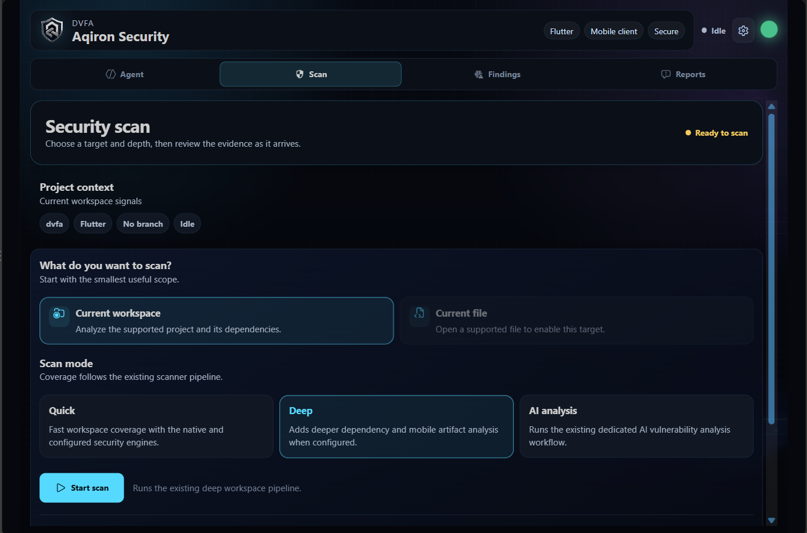 | 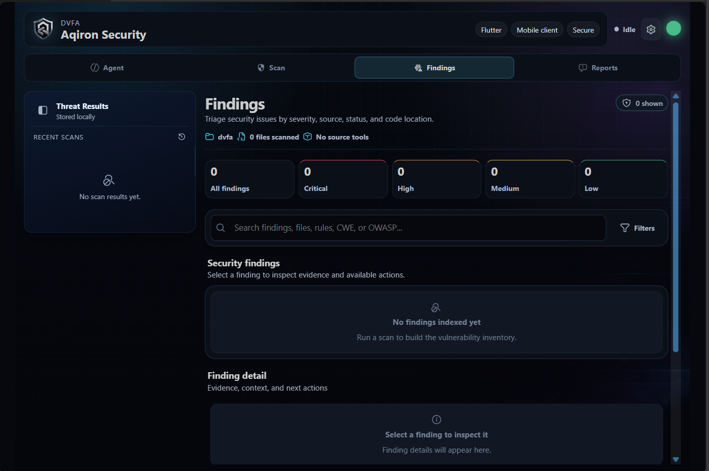 |

| Reports workspace | Agent |
| --- | --- |
| 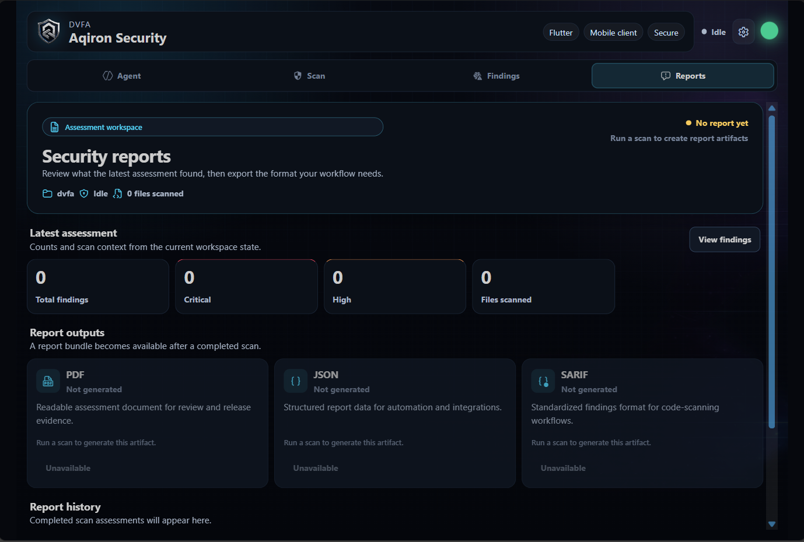 | 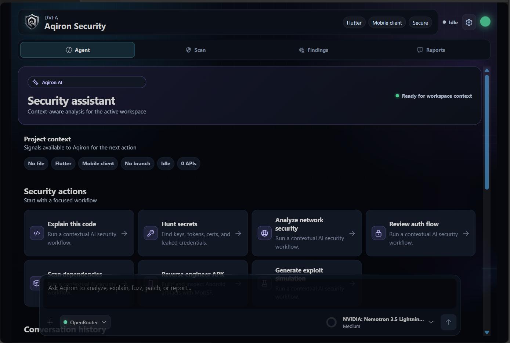 |

The current webview also has redesigned application navigation, Settings, and workspace-index onboarding. Dedicated screenshots for Settings and onboarding are not included.

### Generated PDF assessment

The following supplied screenshots are pages from one generated Aqiron Security assessment PDF. They show its cover, contents, assessment summaries, finding detail, correlation, remediation, and appendix. Counts and findings visible in these screenshots belong to that sample report.

<details>
<summary>View the generated PDF page gallery (10 pages)</summary>

| Cover | Contents |
| --- | --- |
| 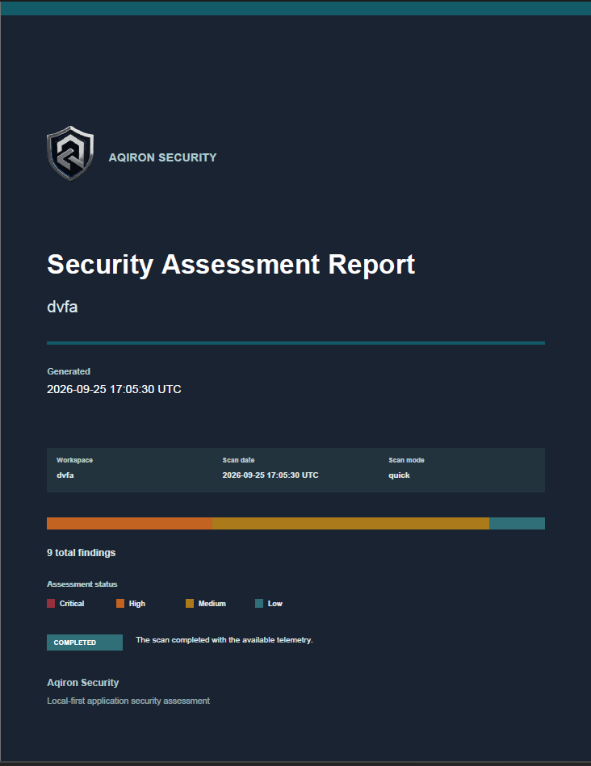 | 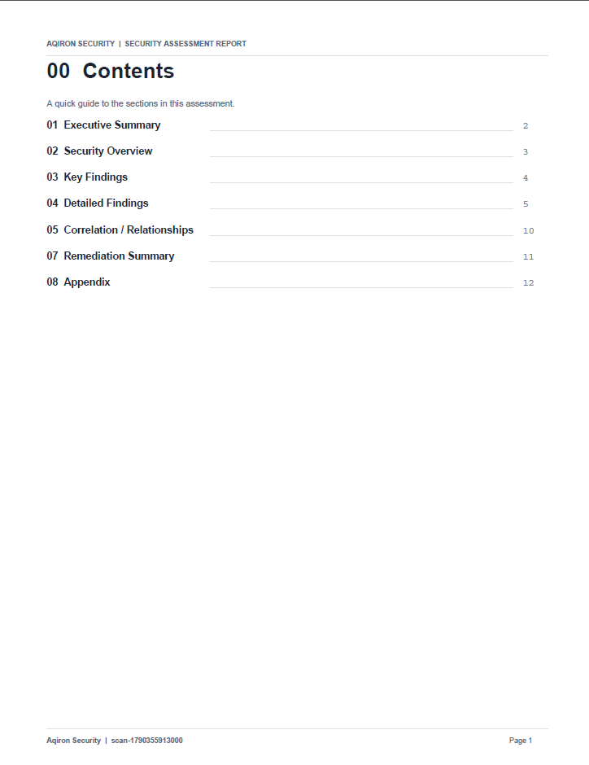 |

| Executive summary | Security overview |
| --- | --- |
| 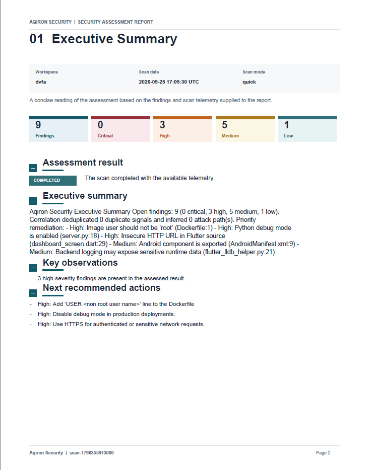 | 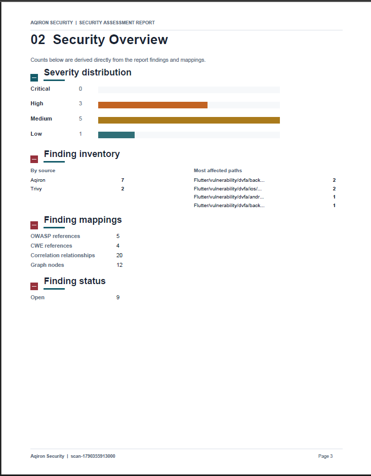 |

| Key findings | Detailed finding: container configuration |
| --- | --- |
| 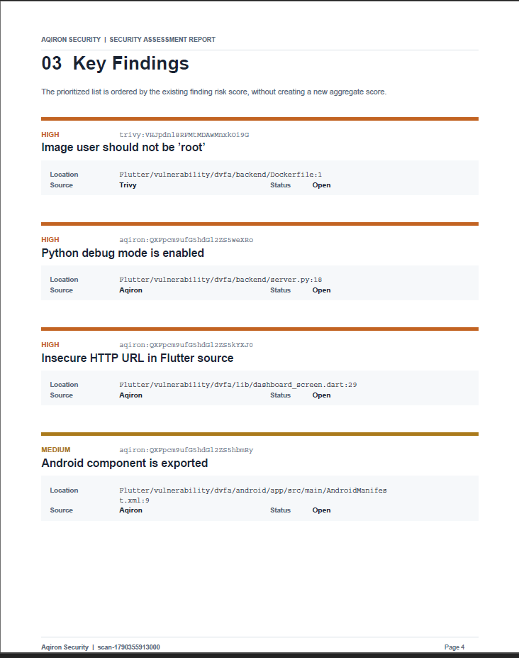 | 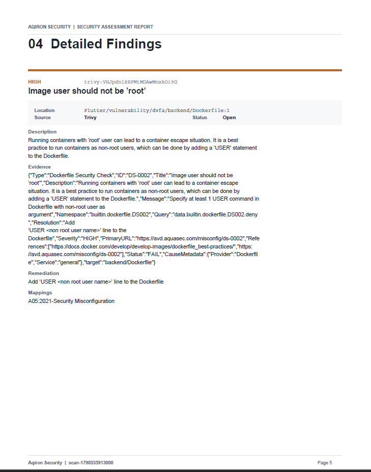 |

| Detailed finding: application code | Correlation and relationships |
| --- | --- |
| 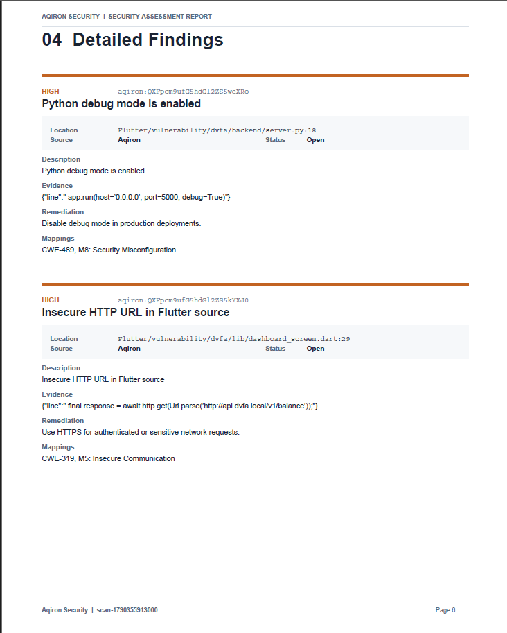 | 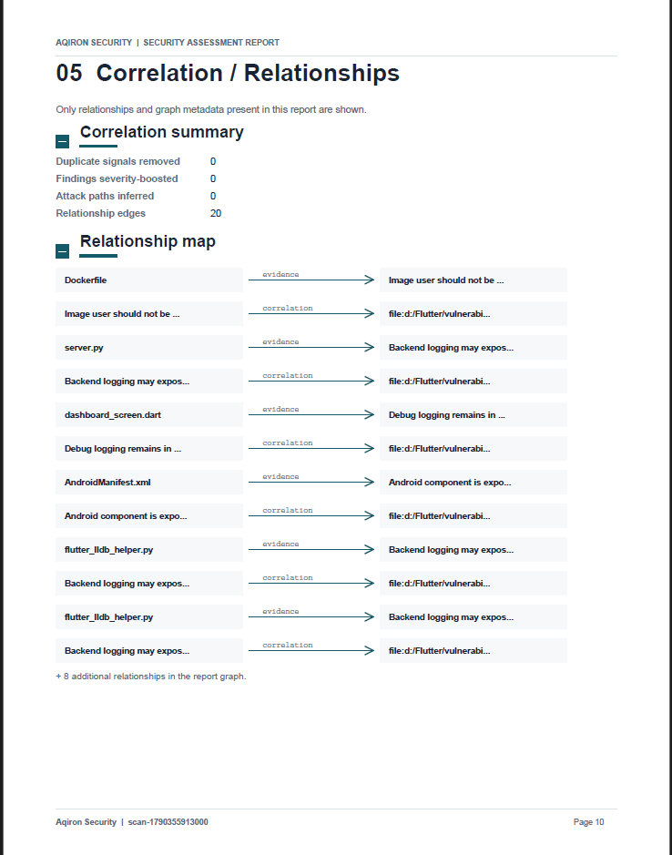 |

| Remediation summary | Appendix |
| --- | --- |
| 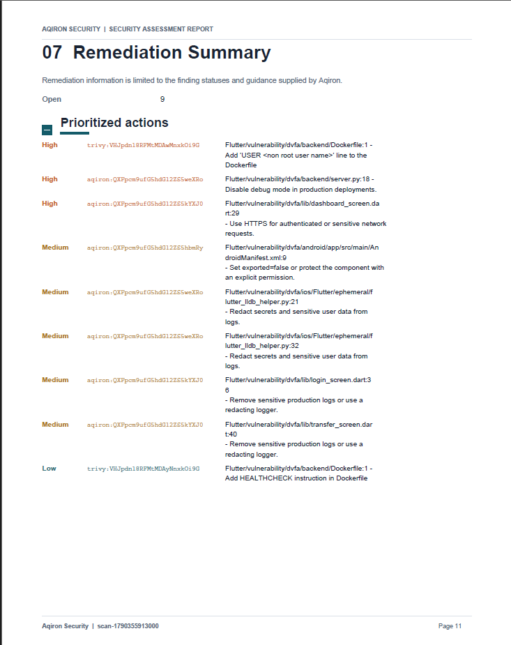 | 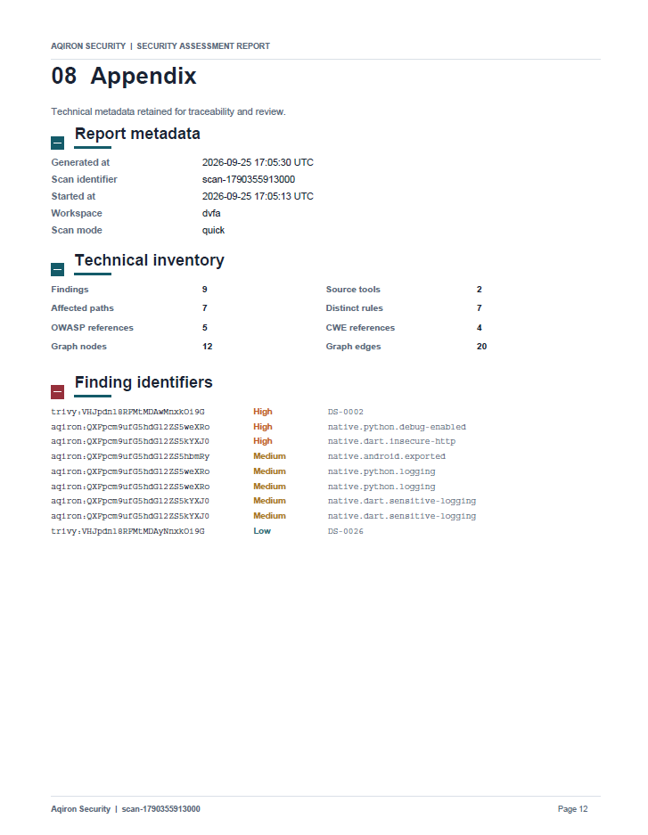 |

</details>

## What is implemented

- **Security scanning:** Quick and deep workspace scans, current-file scanning where supported, live pipeline/tool status, cancellation, and scan results. Workspace operations currently require a Flutter workspace. Built-in pattern rules cover Dart plus selected Python, Android XML, Dockerfile, and configurable custom-rule patterns; this is not a claim of general workspace support for those languages.
- **Scanner integrations:** The Core runtime registers Betterleaks, OSV-Scanner, Semgrep, Trivy, and MobSF adapters. They are optional: availability, mode, target, and configuration affect whether an adapter can run. Install executable tools separately and make them available to the extension environment. MobSF requires a configured server URL and API key. A missing or unconfigured tool is reported as unavailable rather than as a successful scan.
- **Finding pipeline and triage:** Scanner results are normalized into Aqiron findings, correlated/deduplicated, and can be inspected by severity, source, status, and location. The Findings screen supports search/filtering, stored scan snapshots, source navigation, ignore actions, AI explanation/fix prompts, export, and rule creation where applicable.
- **Workspace intelligence (RAG):** A bounded local index of supported workspace files and security signals supports retrieval of relevant project context. Index building can run without AI. AI suggestions can optionally be generated after indexing. The index and scan history are workspace data; keep `.aqiron-security/` private and out of commits.
- **Optional AI:** The implemented providers are OpenRouter, OpenAI, Anthropic Claude, and Google Gemini. The Agent supports streamed chat and workspace-aware security actions. Separate AI review and vulnerability-analysis flows can use normalized findings and retrieved workspace evidence to produce explanations, analysis, and remediation guidance. AI output is advisory; validate it against the source and scanner evidence. Requests send selected context to the configured provider. **Ollama is not a current provider** (legacy Ollama settings are migrated away).
- **Reports:** A completed assessment can be exported as PDF, JSON, and SARIF. The structured PDF includes a cover and assessment context, executive summary, overview, findings, and applicable correlation/scanner/remediation sections. JSON contains the report model; SARIF uses version 2.1.0. Artifacts are written under `.aqiron-security/reports/`; locally stored scan snapshots are available as report/findings history.
- **VS Code integration:** The extension contributes commands, diagnostics, status-bar access, current-file scanning, save-triggered scanning for supported files, and limited deterministic quick fixes for specific findings. Workspace exclusions and related options are declared in the extension settings.

External scanner binaries/services and AI credentials are not bundled. Aqiron does not require an Aqiron-hosted service or an AI subscription to run its non-AI scanning and local-index paths; provider costs and data-handling terms depend on the AI service a user chooses.

## Security workflow

```text
Create/Open Workspace → Configure / Settings → Scan → Findings → Reports → Agent
```

1. **Create/Open Workspace:** Open a project folder in VS Code. Aqiron’s onboarding builds a local security workspace/index for that folder; it does not create or open folders itself. Workspace indexing and scanning require a trusted Flutter workspace.
2. **Configure / Settings:** Add optional AI credentials, set MobSF URL/key, adjust general/accessibility preferences, and edit the existing Flutter custom rules.
3. **Scan:** Choose a supported target and scan mode. Review progress, tool availability, execution output, and completion state.
4. **Findings:** Search and filter the normalized results, inspect evidence and remediation, navigate to source locations, and use available triage actions. Scan snapshots are stored locally in `.aqiron-security/threats.json` (up to the implementation’s configured retention limit).
5. **Reports:** Review assessment context/history and export available PDF, JSON, or SARIF artifacts.
6. **Agent:** Ask questions about the workspace, findings, and code, or launch focused security actions using the selected AI provider. The Agent is optional and does not replace deterministic scans.

The current UI redesign is implemented as screens inside the VS Code webview: application shell/navigation, Scan workflow, Findings triage, Reports workspace, Agent, Settings, and workspace-index onboarding. These are not separate desktop applications or independently deployed product modules.

## Aqiron CLI

The repository includes an in-repository CLI for local developer and CI scans. It calls Aqiron Core through the existing Node Core client; it does not bundle a separate scanner implementation. Build the CLI and Core runtime together with `npm run cli:build`, then run it from the repository:

```sh
node dist/aqiron-cli.js scan <path> --trust-local-workspace
node dist/aqiron-cli.js scan <path> --format json --output result.json --trust-local-workspace
node dist/aqiron-cli.js scan <path> --format sarif --output result.sarif --trust-local-workspace
node dist/aqiron-cli.js scan <path> --fail-on high --trust-local-workspace
```

The trust flag is required before a local workspace is sent to Core as trusted. Text is the default output; JSON and SARIF use Core's report data. Output goes to stdout unless `--output` is given; existing output files are not overwritten. Exit code `0` indicates a completed scan without a configured severity violation, `1` indicates a Core/runtime/cancellation/output failure or a matching `--fail-on` finding, and `2` indicates invalid usage or input. The CLI is built from source and is not yet a published standalone package. [CLI architecture and JSON shape](docs/architecture/cli-prototype.md) includes a minimal consumer-side GitHub Actions example that builds Aqiron from a source checkout, emits SARIF, and gates on severity; there is no repository-owned workflow or stable release distribution yet.

## Architecture

```text
VS Code Extension (host, commands, diagnostics, React webview)
       ↓
Core Client / Process Manager
       ↓
stdin/stdout IPC (newline-delimited JSON)
       ↓
Aqiron Core Runtime (TypeScript, bundled with the extension)
       ↓
scanners → finding normalization/correlation → optional AI/RAG → reports
```

The extension owns VS Code integration and the webview. The Core Client starts and supervises the bundled Node.js runtime and exchanges requests/events over stdio. The runtime coordinates registered scanners, finding normalization and correlation, optional AI and RAG services, and report generation. Current-file quick scans also have an extension-side scanner path. `packages/core/` is private and bundled into `dist/core-runtime.js`; it has not been split into a separately published repository.

Useful implementation references: [architecture diagrams](ARCHITECTURE_DIAGRAMS.md), [RAG implementation notes](AQIRON_SECURITY_RAG.md), [extension manifest and settings](package.json), and [contribution guide](CONTRIBUTING.md).

## Requirements and optional tools

- VS Code version satisfying `^1.118.0` (from `package.json`).
- Node.js and npm suitable for the checked-in package lock and development scripts.
- A trusted Flutter workspace for workspace scanning and RAG indexing.
- Optional external scanner installations/configuration for the corresponding checks: Betterleaks, OSV-Scanner, Semgrep, Trivy, and MobSF.
- Optional credentials for one of the implemented AI providers (OpenRouter, OpenAI, Claude, or Gemini).

Exact scanner invocation, target, and availability behavior is determined by the current scan mode and Core adapter. Scanner implementations and parsers live under [`packages/core/src/scanners/`](packages/core/src/scanners/); the extension resolves client policy and presents results. Do not treat example commands in older design notes as proof that a tool runs in every mode.

## Build and run from source

Clone the repository and install the lockfile-pinned dependencies:

```powershell
git clone https://github.com/aqiron-security/aqiron-security.git
cd aqiron-security
npm ci
```

Compile and validate the extension:

```powershell
npm run compile
npm test
```

For interactive development, open the repository in VS Code and press **F5** to launch the configured Extension Development Host. `npm run watch` starts the TypeScript and esbuild watchers. Individual checks are available with `npm run check-types` and `npm run lint`; `npm run package` runs the production build checks and bundling. `npm test` runs the configured VS Code test suite (with the repository’s `pretest` compilation steps).

## Repository layout

| Path | Purpose |
| --- | --- |
| `src/` | VS Code extension host, commands, scanners, AI/RAG services, React webview, and tests. |
| `packages/core/` | Private TypeScript Core runtime, scanner adapters, findings pipeline, AI/RAG services, and report exporters. |
| `assets/`, `resources/` | UI screenshots, icons, logos, and extension resources. |
| `scripts/`, `esbuild.js` | Test/build helpers and extension/Core/webview bundling. |
| `.vscode/`, `.github/` | Development launch/tasks and issue/pull-request templates. |
| `.aqiron-security/` | Generated workspace index, history, and report artifacts; do not commit workspace data. |

## Contributing and community

Aqiron Security is developed in the open. Start with [`CONTRIBUTING.md`](CONTRIBUTING.md), then check the [GitHub repository](https://github.com/aqiron-security/aqiron-security) for current issues and pull requests. Use the repository’s [bug report](.github/ISSUE_TEMPLATE/bug_report.md) or [feature request](.github/ISSUE_TEMPLATE/feature_request.md) template for public, non-sensitive discussion. Do not report exploitable vulnerabilities, credentials, or private workspace data publicly; follow [`SECURITY.md`](SECURITY.md) instead. The [Code of Conduct](CODE_OF_CONDUCT.md) applies to project participation.

The project is licensed under the [Mozilla Public License 2.0](LICENSE). See [`ROADMAP.md`](ROADMAP.md) for ideas and areas to validate; roadmap items are not implemented features or delivery commitments.
