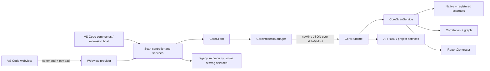
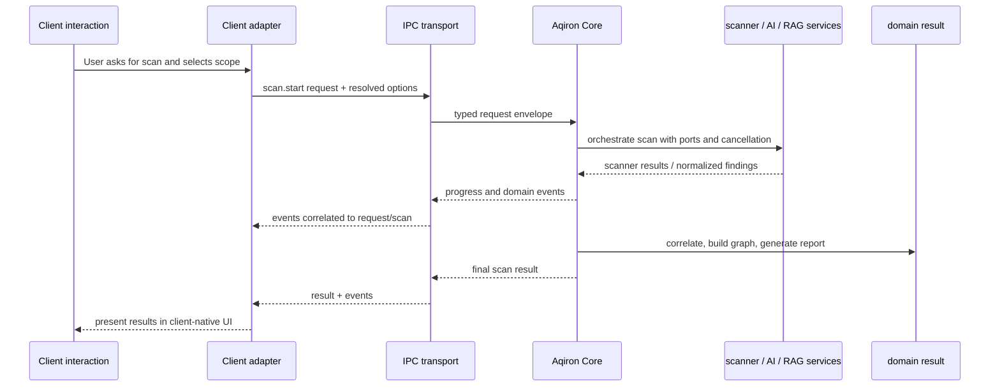
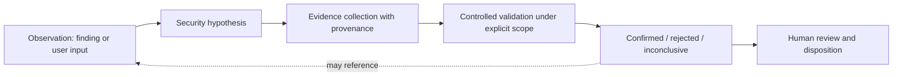

# Aqiron Core architecture

**Status:** architecture preparation (2026-10-01)
**Scope:** describe the checked-in implementation and recommend boundaries for future VS Code, CLI/CI, and Desktop clients. This is not a package split or a behavior change.

This document uses **Current** for behavior demonstrated by this repository, **Near-term** for boundary work that can be done while this remains one repository, and **Future** for capabilities not present yet. The implementation is the source of truth; proposed method names below are illustrative contracts, not existing APIs unless explicitly called Current.

## Current architecture

The repository is still a VS Code extension package with an embedded Core source tree. Root scripts build/typecheck/lint both `src` and `packages/core/src`; `@aqiron/core` is private and exports its TypeScript source. The extension bundles a separate Node Core runtime.

There is a real process boundary, protocol version handshake, request/response correlation by id, event forwarding, timeout cancellation, health check, and crash restart in `src/core/coreProcessManager.ts`. The transport is line-delimited JSON on child process stdio, not a general transport abstraction.

### Responsibilities visible today

| Area | Current implementation |
|---|---|
| Client / VS Code host | `src/extension.ts` registers VS Code commands/providers and creates `CoreClient`; `ScanController`, webview provider, VS Code configuration, workspace trust and editor interactions adapt user actions. |
| Core runtime | `packages/core/src/runtime/coreRuntime.ts` constructs Node adapters, scanner manager, RAG/context/AI/report services; dispatches protocol methods; keeps scan/request state. |
| Core domain and orchestration | Core owns scanner registry/manager, native workspace scanning, parsers, finding normalization, correlation/relationship graph, scan event/state types, RAG retrieval/indexing, project detection, AI services, report generation, telemetry. |
| Shared data | `packages/core/src/shared/` contains finding/issue, source-span, scanner, pipeline, AI, RAG, cancellation and platform-port contracts. The extension imports many types directly from `packages/core/src`; these are shared by convention, not through an independently versioned contract package. |
| IPC | Protocol envelopes and DTOs are in `packages/core/src/runtime/protocol.ts`; process lifecycle/framing/retries/timeouts are in `src/core/coreProcessManager.ts`; typed convenience methods and event-stream adaptation are in `src/core/coreClient.ts`. |
| Scanner-specific | Scanner implementations and their adapters/parsers in Core handle tool invocation, output parsing and findings. `ScannerContext` supplies filesystem, process runner, network, configuration, credentials, logger, cancellation and environment ports. |
| UI-specific | Webview components/state/rendering, command registrations, editor navigation/diagnostics, prompts, settings UI, branch actions, notifications, and translation to/from webview models belong in `src/`. |

### What is already client-independent

**Current:** Core's scanner interfaces and manager; scanner parsing/normalization; `UnifiedFinding`; correlation and graph algorithms; project-profile detection; RAG indexing/retrieval services; AI provider/model/chat/review/analysis services; `CoreScanService`; report model/generator/exporters; event/state contracts. Their domain logic does not inherently require VS Code.

That does not make every current public-looking API ready for a CLI/Desktop client. Some accept local absolute paths and Core runtime currently binds concrete Node adapters. `CoreScanService` receives emitter, scanner manager, report generator, and adapters as dependencies; this is a useful seam, but not yet a stable package/client API. At runtime, `startScan` currently passes `aiAnalysis: undefined`, so the pipeline's optional AI analysis adapter is not wired there.

### VS Code coupling and duplicated paths

- `CoreClient` and `CoreProcessManager` live in `src/core`; the process manager uses Node child processes and host metadata. The extension uses this Node-only client, and the CLI proof bundles it for headless use. It remains an in-repository seam rather than a separately packaged public client API.
- `src/extension.ts`, `src/commands/scanController.ts`, `src/webview/aqironWebviewProvider.ts`, `src/views`, `src/providers`, and diagnostics use VS Code APIs and should remain adapters/presentation.
- Webview types `src/webview/ui/types.ts` contain UI-only values and aggregates (section, zoom, selected threat, chat panel state, setup animation, assets, presentation counts). `WebviewIssue` is a projection of a finding, not the domain finding.
- Core protocol uses filesystem paths and Node runtime metadata. These are environment-neutral in concept but currently assume a local filesystem/workspace and Node transport.
- Core configuration is not yet a coherent cross-client contract: runtime's `projectConfiguration` reads hard-coded JSON paths/keys, while extension configuration is declared in root `package.json` and also read through VS Code. Scanner configuration ports are neutral, but their current provider is Core's JSON lookup.
- There are parallel implementations in `src/security`, `src/ai`, `src/rag`, and `packages/core/src`. For example legacy pipeline/orchestrator, parsers/scanners, finding/report/RAG/analysis services coexist with Core equivalents. The extension imports legacy report-generation types and has its own report storage/generation. Do not assume a feature shown in the UI is implemented by the Core runtime.
- Protocol version is explicit. Phase 1 now maps each current method to params and results at compile time and validates request envelopes and required parameter shapes before dispatch. The JSON-line wire shape and method names remain unchanged. Result payloads and event payloads still cross JSON as runtime values, and nested domain objects are not fully schema-validated; see [core-implementation-inventory.md](core-implementation-inventory.md).

## Current operations and IPC boundary

The actual runtime dispatch in `CoreRuntime.handle` is the authoritative method list:

| Current IPC method | Classification | Notes |
|---|---|---|
| `core.handshake`, `core.health`, `core.info`, `core.shutdown`, `core.cancel` | Generic Core runtime operations | Lifecycle and request cancellation, not security-domain operations. |
| `project.detect`, `project.profile` | Generic project/domain operations | Uses workspace root; profile result includes detected security signals. |
| `scan.start`, `scan.file`, `scan.cancel`, `scan.status` | Generic security operations | `scan.start` remains the existing workspace pipeline. New `scan.file` is an exact-file operation with explicit content and resolved policy; it does not redirect existing callers. |
| `rag.index`, `rag.status`, `rag.query` | Generic security-context operations | Index request can request AI; query currently builds a minimal profile around the query. |
| `ai.providers`, `ai.models`, `ai.cancel`, `ai.chat`, `ai.review`, `ai.vulnerabilityAnalysis` | Generic AI/security-analysis operations | Provider and model selection are domain/service capabilities; selection settings and UX remain client concerns. |
| `credentials.status`, `credentials.set`, `credentials.delete`, `credentials.exists` | Generic credential service operations | Credential storage implementation is injected/defaulted by the host runtime. Client must own consent and secret-entry UX. |
| `report.generate` | Generic report operation | Accepts findings/correlation/graph/telemetry or a scan id and returns report content. |
| Webview commands such as `focus`, `setZoom`, `ready`, `setupComplete`, `openIssue`, `checkoutBranch`, `createBranch`, `openPolicy`, `openRagSettings` | VS Code/UI-specific | These are not Core IPC. They are handled by the webview provider/host. |
| Webview intent such as `scanWorkspace`, `cancelScan`, `sendChat`, `ignoreIssue`, `exportReport` | UI-to-client interaction | Provider currently dispatches them; `workspace.scan` for Agent uses generic `scan.start`, while `secrets.scan` retains its local adapter. Keep the message contract distinct from Core protocol. |

The webview contract is currently `{ command: string; payload?: unknown }`. Provider inbound cases are at `aqironWebviewProvider.ts:356-524`; outbound `postMessage` updates send a large UI state projection. A future client should not implement this contract.

The process manager owns newline framing, pending request map, error decoding, timeouts, cancellation messages, handshake and restart policy. Its request method now constrains method/params and derives the response type from the method. Core owns method dispatch and security work, with structural validation before handlers. Keep domain event payloads transport-independent; framing, process lifecycle and reconnect policy belong to each host transport adapter. Event payloads remain loosely typed at the outer transport envelope today.

## Finding, report and configuration contracts

### Current types

- `UnifiedFinding` in `packages/core/src/shared/finding.ts` is the strongest existing domain contract: identity/fingerprint, severity, CWE/OWASP, CVSS, location, source tool/rule, confidence, remediation, tags, evidence, graph metadata, lifecycle status and risk score.
- `AqironIssue` and `AqironScanResult` in `shared/issue.ts` are another finding/result shape; `findingToIssue` and `issueToFinding` convert between shapes. Keep one canonical domain representation eventually and use client projections at edges.
- `SecurityReportModel` / `SecurityReportContent` in `reports/reportModels.ts` are Core-side report contracts. They include findings, correlation summary, graph, telemetry, text, SARIF and a PDF string. Paths, save dialogs and report destination are host concerns; rendered formats are export representations.
- `ScannerContext`, `ScannerMode`, `ScannerResult`, `ScanState`, `PipelineEvent`, `ProjectProfile`, `SecurityContext`, `RagIndexData`, AI request/result types and report model are candidates for shared contracts.
- Root extension settings (quick fixes, excludes, realtime behavior, size limits, MobSF endpoint/credential and custom rules) and Core's configuration lookups are not yet one validated portable configuration model.

### Recommendation

**Near-term:** document and validate a single versioned contract surface within this repository; keep file paths, scanner options and evidence formats explicit. Model client settings separately from Core security configuration, then pass resolved configuration into Core via a documented request/adapter. Keep secrets out of ordinary configuration and use a credential-store port.

**Future:** a finding should continue to mean a detected security issue. Research workflow concepts should be separate records linked by stable ids: hypothesis, evidence item, provenance/source, controlled validation result, confidence assessment, investigation state and human review. A confirmed hypothesis may cite or propose findings, but must not silently mutate the existing finding's meaning/status. See the future engine boundary below.

## Proposed Core API boundary

The following is a **Near-term boundary proposal**, not a claim that a stable client-neutral API already exists. Preserve the behavior and algorithms while making the current runtime operations typed, validated and transport-independent.

| Capability | Existing demonstrated operation | Boundary direction |
|---|---|---|
| Runtime lifecycle | `core.handshake/health/info/shutdown/cancel` | Keep transport/lifecycle envelope outside security application service. |
| Project context | `project.detect/profile` | Keep profile detection in Core; accept an explicit workspace descriptor and configuration. |
| Scanning | `scan.start/cancel/status`, `CoreScanService.run`; new `scan.file` | Core owns workspace orchestration as before. The new file operation scans exactly the supplied path/content and returns `UnifiedFinding[]`; client adapters still resolve policy and present results. |
| Findings | Finding converters and Core finding model | Use canonical finding DTOs and client-side projections; define schema/version and stable ids. |
| AI/RAG | Existing AI/RAG dispatch and services | Core owns retrieval/index/query and finding analysis/review; clients own provider choice UX, prompts as user interaction, consent, and display. Provider configuration/credential policy remains explicit. |
| Reports | `report.generate`, `ReportGenerator` | Core owns report model and format generation. Client owns file chooser, destination, reveal/share actions and any UI-specific naming flow. |
| Credentials | credential IPC | Keep secret storage behind a port; each host supplies a secure store and client UI manages input/consent. |

Do not prematurely add a large facade or new public method inventory. First align Core runtime behavior with existing types and determine which current APIs are actually used by the extension.

## Data flow

**Current caveat:** workspace scan events include pipeline progress, some of which is presentation-shaped (`tool`, `log`, stages). Workspace scan identity is canonicalized by `CoreScanService`. The new file operation emits only start/completion metadata and uses the IPC request id as its scan id. See [file-scan-contract.md](file-scan-contract.md) for its limits and migration status.

## Future client boundaries

### VS Code

VS Code owns command palette and editor commands, active-file/workspace selection, workspace trust interaction, diagnostics/quick fixes, tree/webview presentation, notifications, opening source locations, branch/Git actions, settings UI, and choosing export destinations. It adapts these inputs to Core requests and maps Core events/results to VS Code views. It should not own scanner execution, parser rules, correlation semantics, AI analysis, RAG retrieval or report model generation.

### Agent workspace scan migration

**Current:** Agent tool selection, summary wording, commands, state and UI projection remain in `AqironWebviewProvider`. The Agent's `workspace.scan` adapter calls `CoreClient.startScan` (`scan.start`) with the first workspace root, that root as target, deep mode, and the actual `vscode.workspace.isTrusted` value. The adapter preserves the existing Flutter-only gate, converts Core `UnifiedFinding` values to `AqironIssue`, and forwards only request-correlated Core pipeline progress. `secrets.scan` still uses `WorkspaceScanner.scanWorkspace` and keeps its filtering/merge/redaction behavior. See [agent-workspace-scan-migration.md](agent-workspace-scan-migration.md) for observed differences and migration caveats.

### CLI proof

**Prototype / architecture proof — not a production CLI.** `packages/cli/src/cli.ts` implements only `aqiron scan <workspace> --trust-local-workspace`. It validates a local directory and requires that explicit opt-in before calling the existing `CoreClient.startScan` operation with `scan.start` (`deep`, `trusted: true`). It prints correlated Core pipeline progress and a findings summary, returns zero for a completed scan (even when findings exist), and returns nonzero for invalid input or Core failure. It always stops the Core process after the operation. The option is a prototype user acknowledgment, not production-grade trust or policy handling.

The CLI reuses the existing Node-only `CoreClient` and `CoreProcessManager` in `src/core/`; it does not import VS Code APIs or scanner implementations. The build emits `dist/aqiron-cli.js` beside `dist/core-runtime.js`, matching the process manager's existing runtime-path convention. Run `npm run cli:build`, then `npm run cli -- scan <workspace>` (or `node dist/aqiron-cli.js scan <workspace>`). This is an in-repository proof only: no public package, CI policy/config system, richer trust model, cancellation signal mapping, or production packaging is provided. `CoreClient.restartOnCrash` is optional and defaults to the existing VS Code behavior (`true`); the CLI sets it to `false` so a failed headless run surfaces as an error.

**Future CLI / CI:** the client will own environment and policy configuration, CI annotations, credential sourcing, artifact destinations, and signal-to-cancellation mapping. It will continue to request Core operations rather than implement scanner execution, normalization, correlation, or report generation.

### Desktop

The future desktop shell owns window lifecycle, navigation, assessment/project selection UX, local permissions and secure credential UI, result presentation, export dialogs, and client-specific persistence such as recent projects. It invokes the same Core security operations. Desktop-only interaction state must not become part of finding or scan-domain types.

## Future security-research engine boundary

**Future only; no autonomous exploitation or offensive engine is implemented or proposed here.** Place this workflow beside the existing finding pipeline as a separate, policy-gated investigation capability:

An investigation aggregate can own hypothesis text, scope/constraints, linked observations, evidence records, provenance (tool/source, timestamp, version, location, integrity metadata), validation plan/result, confidence with rationale, state and human decision/audit trail. Evidence should be append-only or revisioned with provenance; validation must record whether it ran and its bounded result. Keep this separate from `UnifiedFinding`: findings remain scanner/analysis results with their present lifecycle; investigations reference findings and can produce reviewed findings through an explicit domain operation later. Authorization, target scope, safe validation rules and human approval belong at an explicit policy boundary, not inside an ordinary scan.

## State placement

**Current UI/client state:** selected section/threat, zoom, setup animation, active chat/session UI, filters, assets, transient notification/panel state, provider/model selection controls and webview serialized state. These remain client-owned.

**State with eventual Core/domain ownership:** authoritative scan execution status and cancellation (already partly in Core's `scans` and protocol), scan results/history and stable scan identity, finding triage/status and ignore rules when those must be consistent across clients, project profile/index manifests, RAG index status, report metadata, AI analysis records, and future investigation/evidence/audit state. Today ignored findings, threat snapshots, chat histories, settings and report artifact paths are largely in VS Code/provider/workspace storage. Promote only state that must be shared or reproducible; keep view selections and presentation caches client-side.

## Migration strategy

1. **Current / in-place contract:** `scan.file` now establishes exact-file and in-memory-content semantics without changing `scan.start` or redirecting callers. See [file-scan-contract.md](file-scan-contract.md).
2. **Near-term / in-place:** inventory duplicate `src/security` vs Core code paths and call sites; identify the active implementation per feature. Add protocol payload validation and typed method/event mapping at the existing IPC seam before exposing more clients. Agree canonical finding/report/configuration contracts and add compatibility/version policy.
3. **Near-term / adapter cleanup:** make extension host resolve workspace/config/trust/credentials and pass explicit portable options; keep VS Code command and webview contracts in adapters. Route one feature at a time through Core only where this does not change behavior; remove duplication only after usage and tests confirm the Core path is authoritative.
4. **Current prototype / future production client:** the minimal CLI proof exercises the existing `scan.start` semantics in this repository. Harden configuration, cancellation, packaging and headless dependencies before treating it as a supported CLI; evaluate a Desktop shell later.
5. **Future / research capability:** design separate hypothesis/evidence/investigation records and policy/review lifecycle. Keep it out of the current finding model and scanner pipeline until separately specified.

## Explicitly do not refactor yet

- Do not expand the CLI proof into a production CLI or implement Desktop.
- Do not split the repository or publish `@aqiron/core`.
- Do not rewrite Core, merge duplicate implementations wholesale, or change which scanner runs.
- Do not change scanner ordering, modes, parsers, rules, defaults or findings.
- Do not migrate UI settings or persistence without a cross-client ownership decision.
- Do not turn webview message names into Core protocol methods.
- Do not add autonomous exploitation, validation actions, or an offensive engine.
- Do not expand the finding model with hypothesis/evidence/investigation lifecycle fields.
- Do not treat every existing Core IPC method as a stable public API until schemas, compatibility and host adapters are validated.
